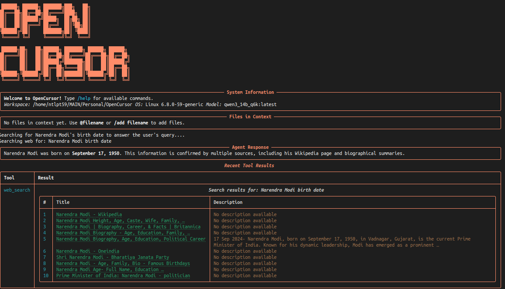

# OpenCursor

An AI-powered code agent for workspace operations with a rich terminal UI.



## Overview

OpenCursor is a terminal-based AI coding assistant that helps you navigate, understand, and modify codebases. It provides both autonomous and interactive agent modes, along with direct LLM chat capabilities. The tool uses a variety of AI-powered features to help you work with code more efficiently.

## Features

🤖 **Local LLM Support** - Works with Ollama models locally

🔄 **Autonomous Mode** - Complete tasks without intervention

🌐 **Playwright Web Search** - No API limits or blocking

📝 **Full Editor Toolkit** - Search, edit, delete files & run commands

🔍 **Transparent UI** - See exactly what the model is doing

## Example Queries

- "Create a simple Flask API with user authentication"
- "Refactor this React component to use hooks instead of classes"
- "Find all usages of this function and update its parameters"
- "Analyze this codebase and explain its architecture"
- "Debug why this test is failing and propose a fix"
- "Research and implement the latest best practices for API security"

## Installation

### Using pip (recommended)

```bash
pip install -U opencursor
```

### Using Poetry

```bash
# Clone the repository
git clone https://github.com/santhoshkammari/OpenCursor.git
cd OpenCursor

# Install with Poetry
poetry install
```

## Usage

Once installed, you can use OpenCursor from the command line:

```bash
# Basic usage
opencursor

# Specify a workspace directory
opencursor -w /path/to/workspace

# Use a different model
opencursor -m "gpt-4"

# Start with an initial query
opencursor -q "Create a simple Flask app"
```

### Command-line Options

- `-w, --workspace`: Path to the workspace directory (default: current directory)
- `-q, --query`: Initial query to process
- `-m, --model`: LLM model to use (default: qwen3_14b_q6k:latest)
- `-H, --host`: Ollama API host URL (default: http://192.168.170.76:11434)
- `--no-thinking`: Disable thinking process in responses

## Commands

OpenCursor provides several commands that you can use within the application:

- `/agent <message>`: Send a message to the agent (autonomous mode)
- `/interactive <message>`: Send a message to the agent (interactive mode)
- `/chat <message>`: Chat with the LLM directly (no tools)
- `/add <filepath>`: Add a file to the chat context
- `/drop <filepath>`: Remove a file from the chat context
- `/clear`: Clear all files from the chat context
- `/repomap`: Show a map of the repository
- `/focus <filepath>`: Focus on a specific file
- `/diff <filepath>`: Show git diff for a file with syntax highlighting
- `/help`: Show help information
- `/exit`: Exit the application

You can also use shortcuts:
- `@filepath` to quickly add a file to the context


## Development

### Project Structure

```
opencursor/
├── code_agent/
│   ├── src/
│   │   ├── app.py         # Main application with UI
│   │   ├── agent.py       # Agent implementation
│   │   ├── llm.py         # LLM client
│   │   ├── tools.py       # Tool implementations
│   │   ├── prompts.py     # System prompts
│   │   ├── tool_playwright.py  # Web search tools
│   │   └── tool_browser.py     # Browser tools
│   ├── cli_entry.py       # CLI entry point
│   └── __init__.py
├── pyproject.toml         # Poetry configuration
├── requirements.txt       # Dependencies
└── README.md
```

### Core Components

1. **OpenCursorApp**: Main application class that handles the UI and command processing
2. **CodeAgent**: Handles autonomous and interactive modes, manages tool execution
3. **LLMClient**: Interacts with the Ollama API, manages conversation history
4. **Tools**: Implements various tools for file operations, code analysis, etc.

### Setting Up Development Environment

```bash
# Clone the repository
git clone https://github.com/santhoshkammari/OpenCursor.git
cd OpenCursor

# Install dependencies
pip install -e .
# or with poetry
poetry install

# Run the application
python -m code_agent.cli_entry
```

## Dependencies

- Python 3.11+
- Rich: Terminal UI and formatting
- Ollama: LLM API client
- Prompt_toolkit: Command completion and input handling
- Playwright: Web search functionality
- SentenceTransformer: Semantic code search

## License

MIT

## Contributing

Contributions are welcome! Please feel free to submit a Pull Request.

1. Fork the repository
2. Create your feature branch (`git checkout -b feature/amazing-feature`)
3. Commit your changes (`git commit -m 'Add some amazing feature'`)
4. Push to the branch (`git push origin feature/amazing-feature`)
5. Open a Pull Request